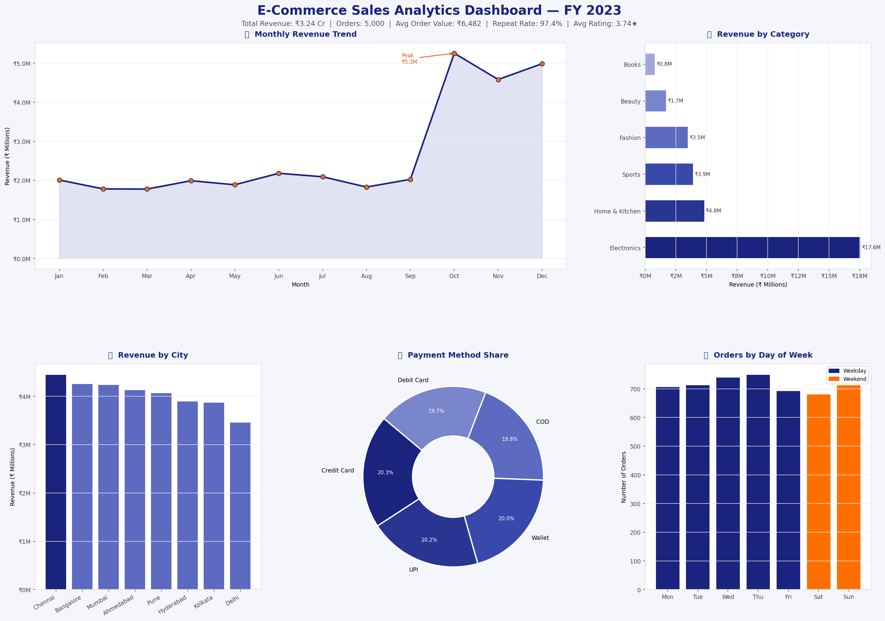

📊 E-Commerce Sales Analytics Dashboard
Python Pandas Matplotlib Excel
End-to-end analytics pipeline — data generation → cleaning → KPIs → dashboard → Excel export
🔑 Key Results
• ₹3.24 Cr total revenue across 5,000 orders
• 14.6% average month-on-month growth
• 97.4% customer repeat purchase rate
• 6-panel executive dashboard + 8-sheet Excel report
🛠 Tools Used
Python, Pandas, NumPy, Matplotlib, Seaborn, OpenPyXL
📸 Dashboard Preview

📁 Files
• ecommerce_dashboard.py — full source code
• ecommerce_dashboard.png — dashboard output
• ecommerce_report.xlsx — 8-sheet Excel report
